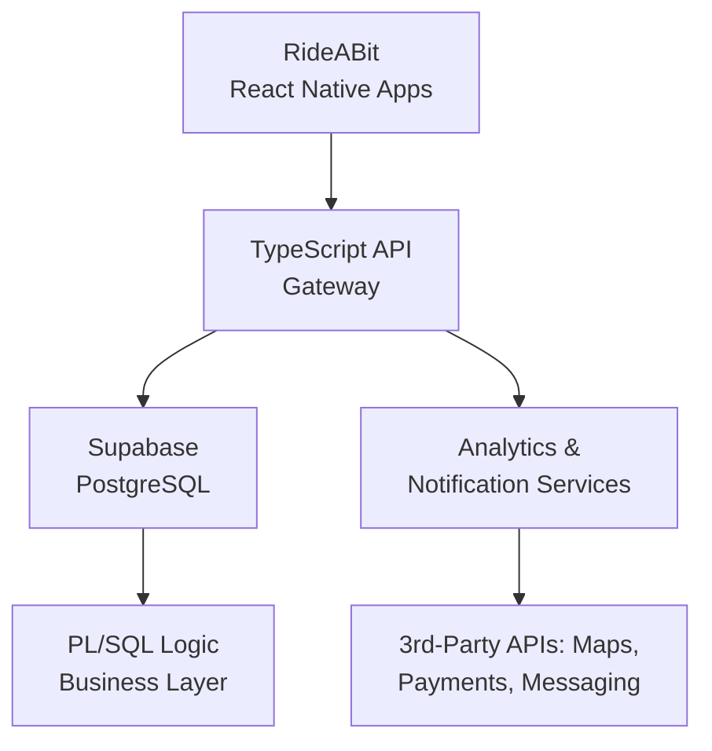

Below is your content rewritten with **correct naming, working links, and consistent branding** for **RideABit** and its apps on both stores.

---

Here is the updated version with **emojis added** to the Website, iOS App, and Android App links:

---

# 🌍 **RideABit: Sustainable Ride-Pooling Platform**

**🌐 Website:** [https://www.rideabit.com/](https://www.rideabit.com/)
**🍎 iOS App:** [https://apps.apple.com/in/app/rideabit/id6751160520](https://apps.apple.com/in/app/rideabit/id6751160520)
**🤖 Android App:** [https://play.google.com/store/apps/details?id=com.rideabit.rideabit](https://play.google.com/store/apps/details?id=com.rideabit.rideabit)

> **Note:** This repository currently includes **documentation only**.
> The full source code remains **private** due to active development and confidentiality.
> Architecture details or demo endpoints can be shared **upon request** for technical review.


---

## 🚀 **Project Overview**

**RideABit** is an environmentally conscious **ride-pooling and shared-mobility platform** designed to reduce urban traffic and carbon emissions.
With enterprise-grade engineering—covering **ACID-compliant transactions**, modular microservices, and automated testing pipelines—the platform reflects production-ready backend design often used in mobility and fintech applications.

The platform uses **TypeScript microservices**, **PL/SQL business logic**, and **Supabase** as the secure, cloud-native database layer.

---

## 🏗️ **System Architecture**



### 🔹 **Key Components**

| Layer              | Technology                  | Description                                                                                                      |
| ------------------ | --------------------------- | ---------------------------------------------------------------------------------------------------------------- |
| **Mobile App**     | React Native                | Cross-platform RideABit app for ride creation, pooling, matching, and trip management.                           |
| **Backend API**    | TypeScript (Express/NestJS) | Handles authentication, route orchestration, ride lifecycle, payment workflows, and trip logic.                  |
| **Database**       | Supabase (PostgreSQL)       | Managed ACID-compliant DB with real-time sync and granular role-based access control.                            |
| **Business Logic** | PL/SQL Packages             | Critical logic for pricing, trip lifecycle, matching, and transactional integrity runs inside stored procedures. |
| **Automation**     | Shell Scripts               | Environment setup, migrations, backups, and monitoring.                                                          |
| **Testing**        | Jest + utPLSQL              | Comprehensive automated tests at the API and database layers.                                                    |

---

## 🧩 **Engineering Highlights**

### ✅ **ACID Transactional Integrity**

Every booking, ride-pool match, and payment is executed within atomic and durable transactions for consistency and safety.

### 🔐 **Secure Modular Architecture**

A strict separation between PL/SQL business rules and the TypeScript API ensures minimal attack surface and enforces principle of least privilege.

### 🔄 **CI/CD with GitHub Actions**

Automated pipelines run:

* Linting
* Jest API tests
* utPLSQL database tests
* Docker builds & deployments

### ☁️ **Cloud-Native Data Layer**

Supabase provides:

* High-availability PostgreSQL
* Integrated auth
* Row-Level Security (RLS)
* Real-time triggers and channels

### 🛠️ **Unix-Based Automation**

Shell scripts handle:

* Deployments
* DB migrations
* Monitoring
* Environment provisioning

---

## 🧪 **Testing & Quality Assurance**

| Test Layer            | Framework         | Purpose                                                     |
| --------------------- | ----------------- | ----------------------------------------------------------- |
| **API Unit Tests**    | Jest              | Validate core backend logic and endpoints.                  |
| **Integration Tests** | Mocha / Supertest | Test multi-service workflows, trip lifecycle, and matching. |
| **Database Tests**    | utPLSQL           | Ensure reliable stored procedure logic and ACID safety.     |
| **CI/CD**             | GitHub Actions    | Automated tests, build validation, and deployments.         |

Example Commands:

```bash
./scripts/run_tests.sh   # Run Jest + utPLSQL
./scripts/deploy.sh      # Build and deploy Docker containers
```

---

## 🌱 **Sustainability Impact**

RideABit directly contributes to eco-friendly transportation by:

* Encouraging shared mobility
* Reducing vehicles on the road
* Lowering fuel use and carbon emissions
* Supporting smart-city mobility infrastructure

---

## 🔐 **Repository Status**

The complete source code is **private** due to active development.
This public documentation includes:

* System design
* Architecture details
* Engineering workflow

A secure demo or architecture walkthrough is available on request.

---

## 👨‍💻 **Author**

**Lakshraj Singh Rao**
*Delivery Data Analyst, Turing*
Specialized in LLMs, ML pipelines, PL/SQL engineering, and scalable backend systems.

**Profiles:**

* **LinkedIn:** [https://linkedin.com/in/lakshr1](https://linkedin.com/in/lakshr1)
* **GitHub:** [https://github.com/Lakshr1](https://github.com/Lakshr1)

---

## 🏁 **Keywords**

`RideABit` · `Ride Pooling` · `PL/SQL` · `Supabase` · `React Native` · `TypeScript` · `Microservices` · `ACID Transactions` · `Unix Automation` · `CI/CD` · `Sustainable Mobility`
