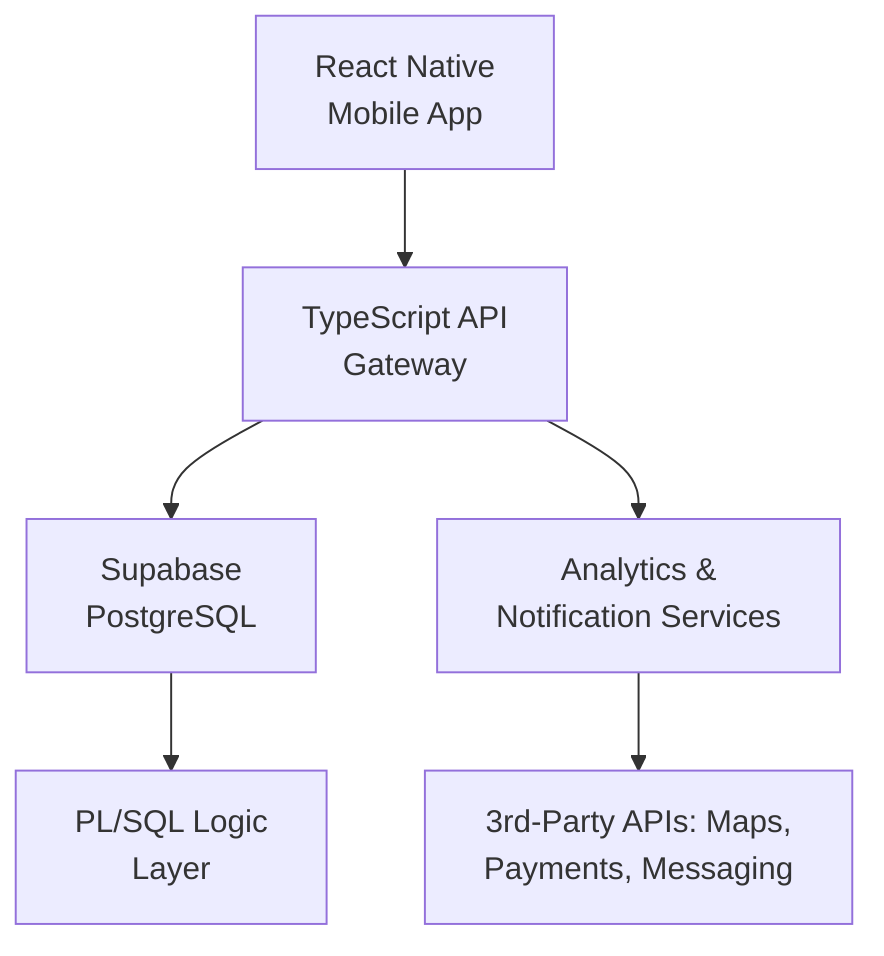

# 🌍 EcoRide: Sustainable Ride-Pooling Platform

> **Note:** This repository currently hosts documentation only.
> The full source code remains **private** due to active development and client confidentiality.
> Access to architecture or demo endpoints can be provided upon request for technical evaluation.

---

## 🚀 Project Overview

**EcoRide** is a sustainability-driven **ride-pooling platform** that promotes shared mobility to reduce traffic congestion and carbon emissions.
Built with enterprise-grade design principles including **ACID-compliant transactions**, modular microservices, and automated testing, it demonstrates production-level backend engineering aligned with real-world fintech and mobility systems.

The platform combines **TypeScript microservices**, **PL/SQL logic**, and **Supabase** as a secure, cloud-native data backbone.

---

## 🏗️ System Architecture



### 🔹 Key Components

| Layer              | Technology                     | Description                                                                                                                |
| ------------------ | ------------------------------ | -------------------------------------------------------------------------------------------------------------------------- |
| **Frontend**       | React Native                   | Cross-platform mobile interface for trip creation and discovery.                                                           |
| **Backend API**    | TypeScript (Express or NestJS) | RESTful API handling authentication, route orchestration, and transaction workflows.                                       |
| **Database**       | Supabase (PostgreSQL)          | Cloud-managed ACID-compliant database with integrated authentication and real-time updates.                                |
| **Business Logic** | PL/SQL Packages                | Stored procedures implement critical business rules such as trip lifecycle, fare computation, and transactional integrity. |
| **Automation**     | Unix / Shell Scripts           | Automated environment setup, testing, and monitoring.                                                                      |
| **Testing**        | Jest and utPLSQL               | Unit and integration testing for both API and database layers executed via CI pipelines.                                   |

---

## 🧩 Engineering Highlights

* **ACID Transactional Integrity**
  Every booking, payment, and trip update is executed within atomic, consistent, isolated, and durable transactions to ensure data reliability and rollback safety.

* **Secure Modular Design**
  Clear separation between business logic written in PL/SQL and the API layer, enforcing least privilege and minimizing attack surface.

* **CI/CD Integration**
  Automated pipelines using GitHub Actions validate code quality, run Jest and utPLSQL tests, and deploy containerized builds.

* **Cloud-Native Data Stack**
  Supabase ensures a high-availability PostgreSQL backend with real-time synchronization and role-based access control.

* **Unix-Based Automation**
  Shell scripts handle environment provisioning, migrations, and system health checks for consistent deployment across Linux environments.

---

## 🧪 Testing and Quality Assurance

| Test Layer             | Framework              | Purpose                                                     |
| ---------------------- | ---------------------- | ----------------------------------------------------------- |
| API Unit Tests         | **Jest**               | Validate core endpoints and logic in isolation.             |
| Integration Tests      | **Mocha or Supertest** | Test multi-service workflows and data consistency.          |
| Database Tests         | **utPLSQL**            | Verify stored procedure correctness and transaction safety. |
| Continuous Integration | **GitHub Actions**     | Auto-executes tests, linting, and static analysis.          |

Example:

```bash
./scripts/run_tests.sh   # Executes Jest and utPLSQL suites
./scripts/deploy.sh      # Builds Docker image and pushes via CI/CD
```

---

## 🌱 Impact

* Promotes environmentally responsible commuting by encouraging shared mobility.
* Demonstrates how robust backend engineering with ACID compliance, automated testing, and modular PL/SQL logic supports scalable, real-time transportation systems.
* Serves as a case study in sustainable system design for urban applications.

---

## 🔐 Repository Status

> The full source code is **private**.
> Documentation, system design, and deployment architecture are publicly available here.
> A limited demo instance or architecture walkthrough can be shared upon request.

---

## 👨‍💻 Author

**Lakshraj Singh Rao**
*Delivery Data Analyst, Turing*
Expertise in LLMs, ML pipelines, PL/SQL, and scalable backend systems.
[LinkedIn](https://linkedin.com/in/lakshr1) · [GitHub](https://github.com/Lakshr1)

---

## 🏁 Keywords

`PL/SQL` · `Supabase` · `TypeScript` · `React Native` · `ACID Transactions` · `Unix Automation` · `Unit Testing` · `Agile Development` · `Sustainability`
